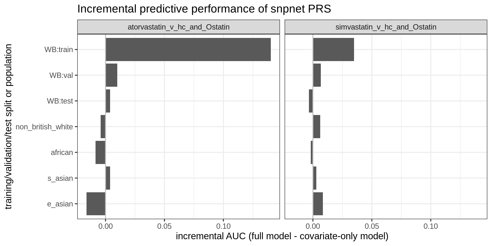
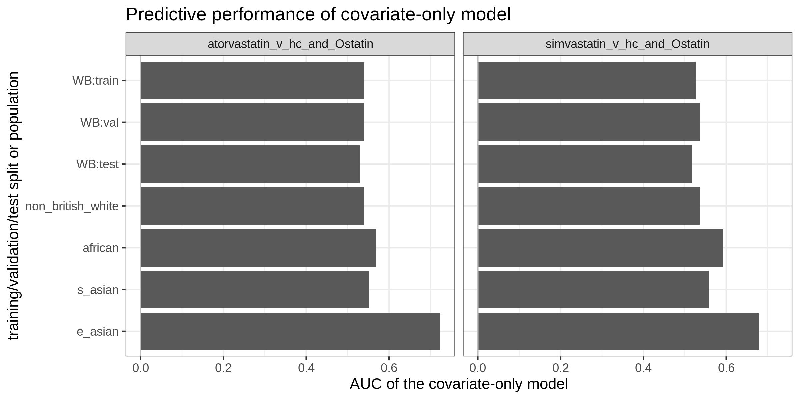

# The `snpnet` polygenic risk score for statin selection

We applied `snpnet` for statin-selection phenotype.

From Greg McInnes, we received the following two files:

- Source phenotype:
  - `/oak/stanford/groups/mrivas/users/gmcinnes/atorvastatin_v_hc_and_Ostatin.phe`
  - `/oak/stanford/groups/mrivas/users/gmcinnes/simvastatin_v_hc_and_Ostatin.phe`

From those phenotype file and the GWAS covariate file (version `20200313`), we prepared phenotype file for `snpnet` using [`1_phe_file_prep.ipynb`](1_phe_file_prep.ipynb).

- Data location:
  - `/oak/stanford/groups/mrivas/users/gmcinnes/statin_risk_score`
  - `statin_PRS_all.phe`: the full table of phenotype & covariates
  - `statin_PRS_snpnet.phe`: the subset of the full table containing the 2 phenotypes, age, sex, and (Global) PC1-PC10 for the individivuals in the training and validation set.

Once we prepared the input data, we applied `snpnet` and characterized the PRS using [`2_snpnet.sh`](2_snpnet.sh).

We evaluated their predictive performance using [`3_performance_eval.ipynb`](3_performance_eval.ipynb). We computed AUC for training, validation, and hold-out test set for genotype-only model, covariate-only model, as well as the full model containing both covariates and genotypes. We additionally focused on 4 populations (non-British white, African, South Asian, and East Asian), refit covariate-only models, and evaluated the performance to assess the transferability of the models.

The results are written in [`3_performance_eval.tsv`](3_performance_eval.tsv) and copied below.

| phenotype_name                | split             | geno      | covar     | geno_covar | geno_delta   | n_variables | case_n | control_n |
|-------------------------------|-------------------|-----------|-----------|------------|--------------|-------------|--------|-----------|
| atorvastatin_v_hc_and_Ostatin | WB:train          | 0.7178386 | 0.5395159 | 0.6796515  |  0.140135539 | 650         |  7993  | 23374     |
| atorvastatin_v_hc_and_Ostatin | WB:test           | 0.5188975 | 0.5288084 | 0.5327297  |  0.003921311 | 650         |  2227  |  6743     |
| atorvastatin_v_hc_and_Ostatin | WB:val            | 0.5325395 | 0.5394602 | 0.5493588  |  0.009898598 | 650         |  1082  |  3355     |
| atorvastatin_v_hc_and_Ostatin | non_british_white | 0.5120478 | 0.5392435 | 0.5350556  | -0.004187855 | 650         |   688  |  2122     |
| atorvastatin_v_hc_and_Ostatin | s_asian           | 0.5170956 | 0.5524261 | 0.5562114  |  0.003785281 | 650         |   414  |  1289     |
| atorvastatin_v_hc_and_Ostatin | african           | 0.4914545 | 0.5694041 | 0.5609252  | -0.008478869 | 650         |   130  |   577     |
| atorvastatin_v_hc_and_Ostatin | e_asian           | 0.4073529 | 0.7235294 | 0.7073529  | -0.016176471 | 650         |    20  |    68     |

| phenotype_name                | split             | geno      | covar     | geno_covar | geno_delta   | n_variables | case_n | control_n |
|-------------------------------|-------------------|-----------|-----------|------------|--------------|-------------|--------|-----------|
| simvastatin_v_hc_and_Ostatin  | WB:train          | 0.5953761 | 0.5263040 | 0.5611164  |  0.034812424 |  97         | 21627  |  9740     |
| simvastatin_v_hc_and_Ostatin  | WB:test           | 0.4950127 | 0.5173717 | 0.5139568  | -0.003414922 |  97         |  6183  |  2787     |
| simvastatin_v_hc_and_Ostatin  | WB:val            | 0.5170911 | 0.5365884 | 0.5432712  |  0.006682822 |  97         |  3113  |  1324     |
| simvastatin_v_hc_and_Ostatin  | non_british_white | 0.5242173 | 0.5358175 | 0.5420629  |  0.006245316 |  97         |  1909  |   901     |
| simvastatin_v_hc_and_Ostatin  | s_asian           | 0.5053133 | 0.5574803 | 0.5604403  |  0.002960026 |  97         |  1191  |   512     |
| simvastatin_v_hc_and_Ostatin  | african           | 0.4927445 | 0.5919472 | 0.5901802  | -0.001766941 |  97         |   539  |   168     |
| simvastatin_v_hc_and_Ostatin  | e_asian           | 0.6382374 | 0.6801706 | 0.6886994  |  0.008528785 |  97         |    67  |    21     |

