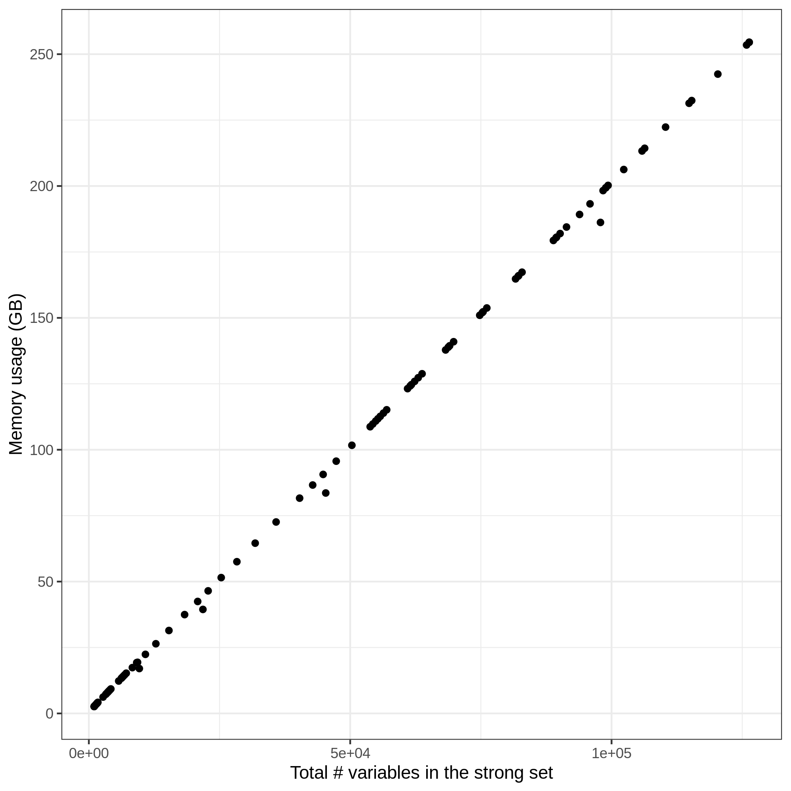

# memory usage in snpnet (version 0.3.15-17)

We investigate the memory usage of snpnet by parsing its log file.

- [`1_extract_memory_info.sh`](1_extract_memory_info.sh): this script extracts the relevant lines from `snpnet.log`
- [`2_tabulate_mem.ipynb`](2_tabulate_mem.ipynb): this Python notebook tabulates the key metric
- [`3_plot_INI50_pfactor_v5_refit.ipynb`](3_plot_INI50_pfactor_v5_refit.ipynb): this notebook generates plot
- [`4_run_debug.sh`](4_run_debug.sh): this wrapper calls snpnet
- [`5_RData_obj.ipynb`](5_RData_obj.ipynb): we also investiate what is saved in the RData file

Memory usage profile from one of our test run for standing height (INI50).
Let's say we have 1e5 variants for 3e5 individuals. That should take 8 * 3e10 Byes = 2.4e8 K Bytes = 2.4e5 M Bytes = 240 G Bytes

