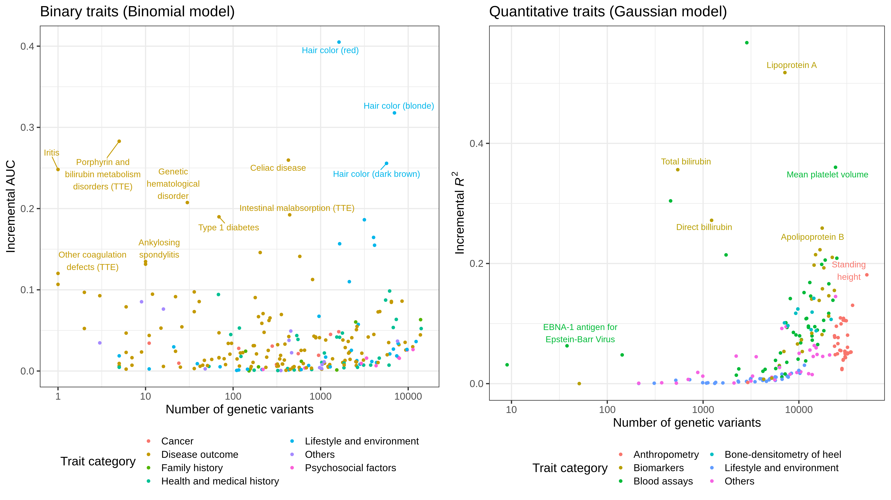
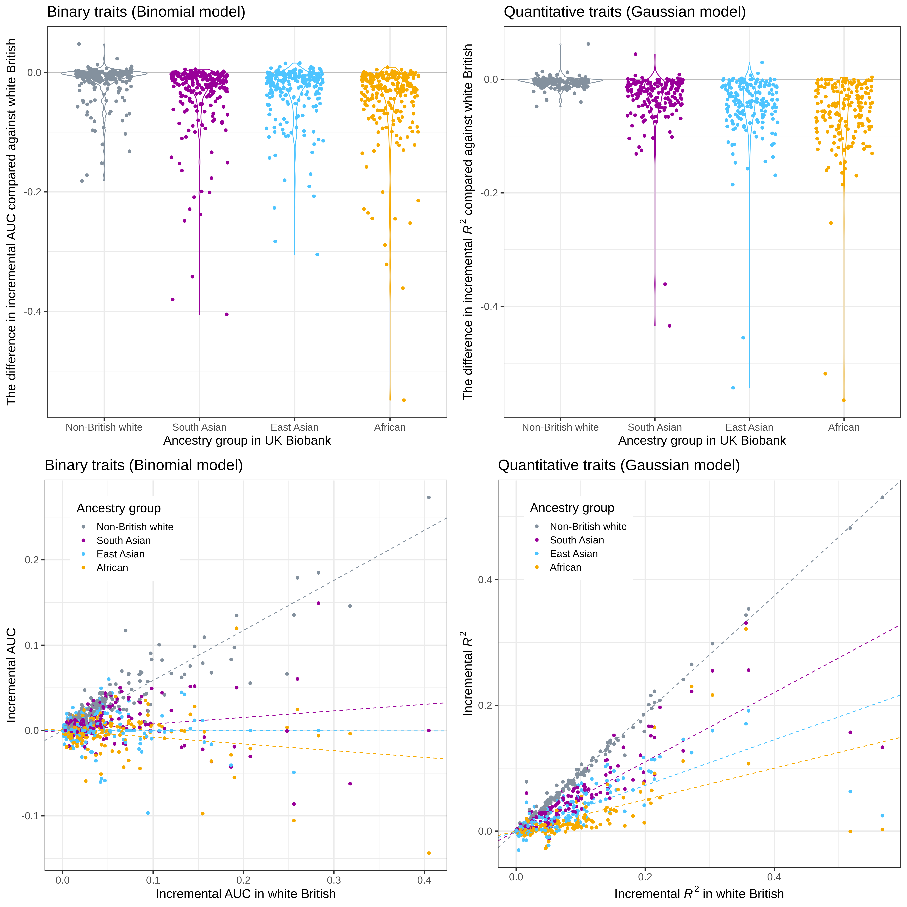

# PRSmap summary and plots


## plots

### Effect size distribution

[](test_set_geno_delta.png)

### Effect size vs. model size

[](test_set_performance_vs_size.png)

- We have interactive plots:
  - http://web.stanford.edu/~ytanigaw/PRSmap/delta_vs_size_binomial.html
  - http://web.stanford.edu/~ytanigaw/PRSmap/delta_vs_size_gaussian.html

```
$ tar -czvf ggplotly.tar.gz ggplotly/
$ rclone copy ggplotly.tar.gz gdrive:Manny/PRSmap_paper/
$ # on Farmshre
$ cd /afs/ir.stanford.edu/users/y/t/ytanigaw/WWW/PRSmap
$ rclone copy gdrive:Manny/PRSmap_paper/ggplotly.tar.gz .
$ # unzip and place them
```

### Trans-ethnic evaluation of the incremenatl predictive performance

[](trans-ethnic.png)


### Example coefficient plot (celiac disease)

[](BETAs_HC303.png)

