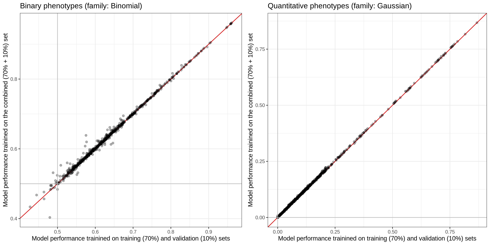

# PRS map version `202009`

We have finalized the running parameters based on [the results from the test runs](/notebook/20200908_PRS_map_test).

## data location

- `/oak/stanford/groups/mrivas/projects/PRS/private_output/202009_batch`
  - currently, it's a symlink to a directory under `/scratch`
- [Google spreadsheet summarizing the performance of the models](https://docs.google.com/spreadsheets/d/1n-Lk2ooPJPG7Zbk8Vu43h_n9dzZWvV7elqQyclWvGI8/edit?usp=sharing)
  - We have two spreadsheets each corresponds to the initial fit with validation set or the refit with the combined (70 + 10) % (training + validation) set.

## performance evaluation

### Comparison of predictive performance in test set w/ and wo/ refit



We plotted the test set performance on the combined model consists of covariates and genetic variants.
When we run `lm(y ~ 0 + x)`, we get the following number as the relative performance improvements.

- Gaussian: `1.006895` (SE: `0.0004027447`)
- Binomial: `1.002266` (SE: `0.0003903395`)


## job submission

We submit jobs using the wrapper script.

```{bash}
bash 2_submit.sh GBE_IDs/FH.lst
bash 2_submit.sh GBE_IDs/cancer.lst
```

For resubmission, we have a similar but more sophisicated script that focuses on the set of phenotypes that are actually making some progress.

```{bash}
bash 2b_submit.sh GBE_IDs_20200926/GBE_IDs.tsv
```

## aggregate the results

```{bash}
bash 5_agg_eval.sh
bash 5_agg_eval.sh refit
```

## snpnet version

We used `snpnet` versions from `snpnet_v.0.3.15` to `snpnet_v.0.3.17`.


## Additional information for each script

### `13_compute_PRS_p_val.{sh,R,lst}`

We evaluate the significance of the PRS model by fitting a glm model on the test set (in WB).

phe ~ 1 + age + sex + PCs + PRS

[`13_compute_PRS_p_val.R`](13_compute_PRS_p_val.R) implements such glm fit and [`13_compute_PRS_p_val.sh`](13_compute_PRS_p_val.sh) is the wrapper script.

We used the following commands for job submission.

```
# generate the list of GBE_IDs for the SLURM jobs
cat ../../data/trait_info.tsv | awk -v FS=',' '(NR>1){print $2}' > 13_compute_PRS_p_val.lst

# update the Git ignore file
echo 13_compute_PRS_p_val.lst >> .gitignore

# run the job
sbatch -p mrivas --time=1:0:00 --mem=6000 --nodes=1 --cores=1 --job-name=PRS_p_val --output=logs/PRS_p_val.%A_%a.out --error=logs/PRS_p_val.%A_%a.err --array=1-355%100 ${parallel_sbatch_sh} 13_compute_PRS_p_val.sh 13_compute_PRS_p_val.lst 5
```
